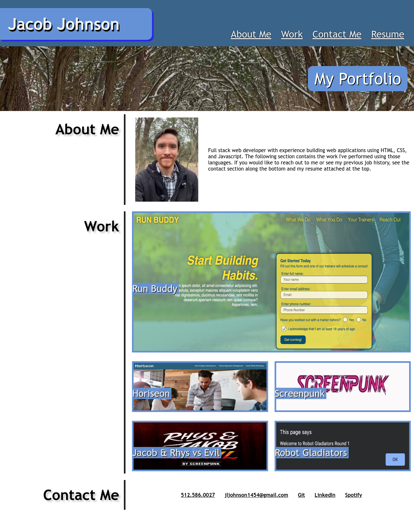

# MY PORTFOLIO

## Purpose
This is a collection of the projects I've worked on so far as a full stack web developer. Using HTML, CSS, I built the following portfolio from scratch, incorporating flex boxes, media queries, and pseudo-classes.

The Run Buddy website on my page is probably the best representation of my skillset as it was an ongoing project for several weeks. The Horiseon site was a refactoring project provided to me to enhance the structure and alleviate excess syntax.

The Screenpunk, Jacob and Rhys vs. Evil, and Robot Gladiators are works in progress.

## Built With
    -HTML
    -CSS

## Website

Github: https://github.com/jljohnson1454/my-portfolio

Portfolio Website: https://jljohnson1454.github.io/my-portfolio/

## Screenshot

## References

    -Run-Buddy
    -Flexbox Cards
    -Media-Queries

## Author
Created by Jacob Johnson